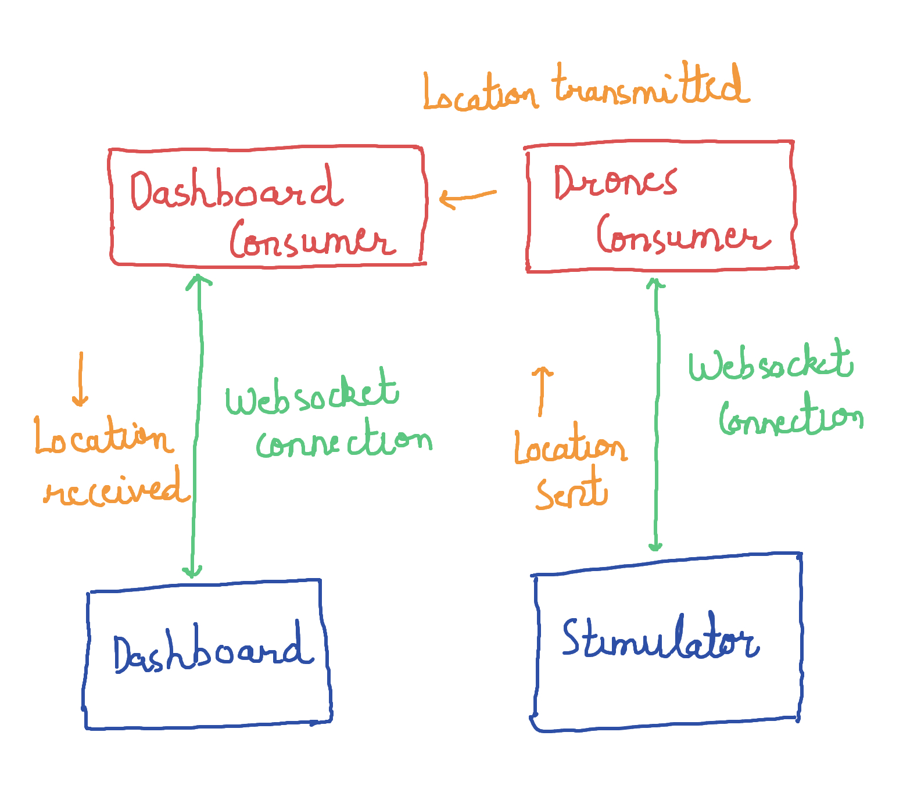
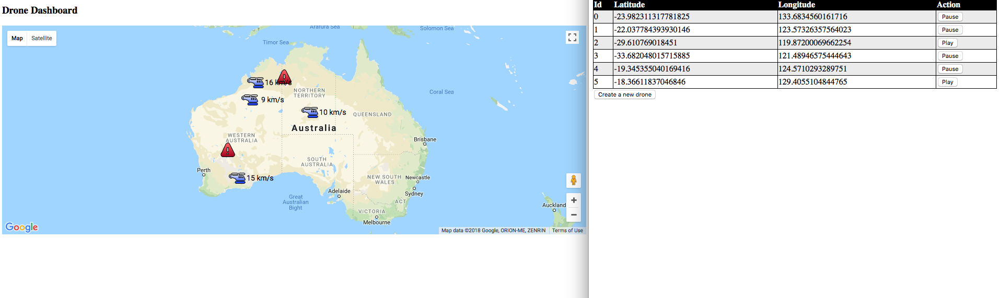

# Drones Dashboard 

---

The goals of this project are the following : 

- Use docker to deploy and run a django application. 
- Use *django-channels* with *websockets* to build a dashboard that shows real time location of drones that are stimulated.

---

## Overview of the Architecture


## Installation
Make sure that you have the **docker** and **docker-compose** cli installed. 
- **[Docker](https://docs.docker.com)** 

Clone this project 

```
git clone https://github.com/manibatra/Drones.git
cd Drones
```

Create a **.env** file in the root directory with the following content. 

```
MAP_KEY=<API accesss key for Google Maps>
DJANGO_SETTINGS_MODULE=mysite.settings
```

The MAP_KEY is for viewing the google map on our dashboard and the DJANGO_SETTINGS_MODULE is for testing.
Build the services using docker-compose

```
docker-compose build
```

Build, create, start and attach containers to the services (redis and the django application)

```
docker-compose up
```


## Usage 
The application will be available at **http://localhost:8000/drones/** . From there you can enter the **dashboard** and the drones **stimulator**. 



Once you start creating drones from the stimulator they will start appearing on the dashboard. You can **pause** a drone to prevent it from sending it’s location. Once a drone has been paused it will be marked on the dashboard. A paused drone can be **play**ed again to being transmitting it’s location. The location of the drone is updated with every transmission by moving it in a  random direction with a random speed which is fixed when the drone is created. To start from scratch just refresh the dashboard and the stimulator. 

## Testing
We will be using **pytest** for testing. To run the tests we will run pytest on our docker container.

```
docker exec mysite_web_1 pytest
```

I have provided one test that tests the transmission of messages between the dashboard and the stimulator. More tests can be added in the future. 


